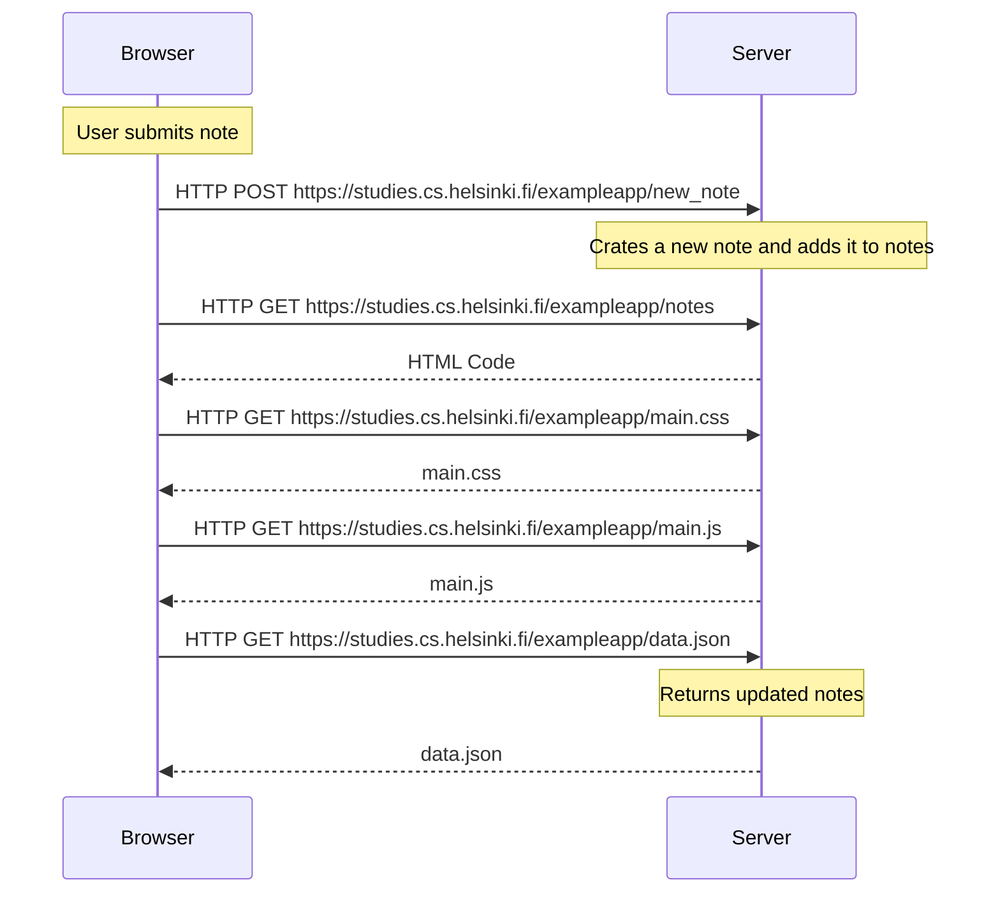

```mermaid
sequenceDiagram
    participant Browser
    participant Server
    Note over Browser: User submits note
    Browser->>Server: HTTP POST https://studies.cs.helsinki.fi/exampleapp/new_note
    Note over Server: Crates a new note and adds it to notes
    Browser->>Server: HTTP GET https://studies.cs.helsinki.fi/exampleapp/notes
    Server-->>Browser: HTML Code
    Browser->>Server: HTTP GET https://studies.cs.helsinki.fi/exampleapp/main.css
    Server-->>Browser: main.css
    Browser->>Server: HTTP GET https://studies.cs.helsinki.fi/exampleapp/main.js
    Server-->>Browser: main.js
    Browser->>Server: HTTP GET https://studies.cs.helsinki.fi/exampleapp/data.json
    Note over Server: Returns updated notes
    Server-->>Browser: data.json
```